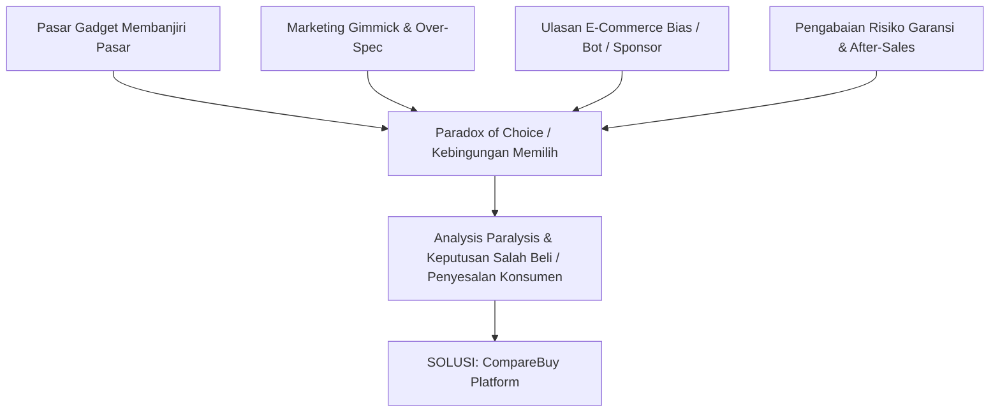
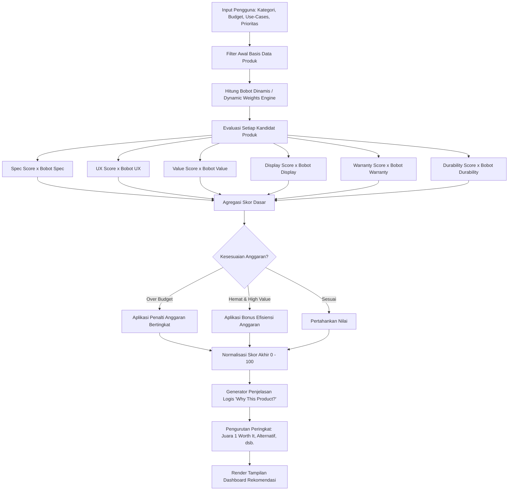

# ⚖️ CompareBuy — Stop Guessing. Start Comparing.

> **Platform Cerdas Rekomendasi & Matriks Perbandingan Perangkat Teknologi Berbasis *Multi-Criteria Weighted Scoring* dan Ulasan Nyata.**

[](#)
[-blue)](#)

---

## 📌 Daftar Isi
1. [Penjabaran Judul](#1-penjabaran-judul)
2. [Big Picture Permasalahan](#2-big-picture-permasalahan)
3. [Kenapa Mengambil Judul Ini](#3-kenapa-mengambil-judul-ini)
4. [Manfaat Proyek](#4-manfaat-proyek)
   - [Bagi Pengembang (Saya)](#-manfaat-bagi-pengembang-saya)
   - [Bagi Orang Lain (Pengguna & Konsumen)](#-manfaat-bagi-orang-lain-konsumen--pengguna)
5. [Fitur-Fitur Utama Platform](#5-fitur-fitur-utama-platform)
6. [Arsitektur Sistem & Scoring Engine](#6-arsitektur-sistem--scoring-engine)
7. [Teknologi yang Digunakan](#7-teknologi-yang-digunakan)
8. [Struktur Direktori Proyek](#8-struktur-direktori-proyek)
9. [Panduan Instalasi & Menjalankan](#9-panduan-instalasi--menjalankan)
10. [Rencana Pengembangan (Roadmap)](#10-rencana-pengembangan-roadmap)
11. [Kontributor](#11-kontributor)

---

## 1. Penjabaran Judul

### **CompareBuy: Platform Cerdas Rekomendasi & Matriks Perbandingan Perangkat Teknologi Berbasis Multi-Criteria Weighted Scoring dan Agregasi Ulasan Nyata**
*(Tagline: "Stop Guessing. Start Comparing.")*

Secara etimologi dan fungsi teknis, judul **CompareBuy** dirumuskan dari dua pilar utama:

* **Compare (Bandingkan Secara Objektif):**  
  Menyediakan kemampuan analisis komparatif berdampingan (*side-by-side*) yang komprehensif. Bukan sekadar menjejerkan tabel data lembar spesifikasi (*datasheet*), melainkan mengevaluasi kompromi teknis (*trade-offs*), reliabilitas komponen, pengalaman kenyamanan penggunaan, hingga kualitas jaminan garansi.
* **Buy (Keputusan Pembelian yang Bijak & Tepat Sasaran):**  
  Berorientasi pada hasil akhir tindakan pembelian konsumen (*informed purchasing decision*). Platform membantu calon pembeli menemukan produk yang paling bernilai tinggi (*Value for Money* / "paling worth it") sesuai alokasi anggaran yang mereka miliki tanpa membuang uang untuk fitur berlebih (*over-specification*) yang tidak pernah mereka butuhkan.

Secara konseptual, **CompareBuy** adalah sebuah *Decision Support System* (Sistem Pendukung Keputusan) interaktif berbasis web untuk belanja perangkat teknologi (Monitor, Laptop, Smartphone, Headphone/IEM, serta Keyboard & Mouse). Platform ini memadukan preferensi personal pengguna, algoritma pembobotan dinamis multi-kriteria (*Multi-Criteria Decision Making / MCDM*), serta sentimen nyata dari komunitas pengguna terverifikasi.

---

## 2. Big Picture Permasalahan

Dalam era pesatnya perkembangan industri teknologi dan e-commerce saat ini, konsumen dihadapkan pada sejumlah tantangan pelik ketika ingin membeli gawai (*gadget*) atau perangkat kerja:



1. **Paradox of Choice & Analysis Paralysis (Kelelahan Memilih):**  
   Setiap bulannya, puluhan produk dan varian baru dirilis dengan perbedaan kode seri yang membingungkan. Calon pembeli kerap menghabiskan waktu berhari-hari hingga berminggu-minggu membuka puluhan tab browser, menonton belasan video review, dan tetap merasa ragu untuk memutuskan.
2. **Jebakan Spesifikasi & Marketing Gimmick:**  
   Banyak produsen menonjolkan satu angka spesifikasi bombastis (misal: refresh rate tinggi atau megapixel kamera besar), namun memangkas kualitas di sektor esensial lain (panel layar redup, build quality ringkih, atau sistem pendingin buruk). Konsumen awam sering terjebak membeli barang dengan angka spesifikasi tinggi di atas kertas namun mengecewakan saat dipakai sehari-hari.
3. **Krisis Kredibilitas Ulasan (Fake & Sponsored Reviews):**  
   Ulasan di marketplace sering kali tidak mencerminkan kualitas produk yang sebenarnya (contoh: review bintang 5 dengan teks *"pengiriman cepat, barang belum dibuka"* atau ulasan bayaran bot). Di sisi lain, konten ulasan di media sosial kerap terikat kontrak sponsor (*paid endorsement*) yang enggan membedah kekurangan produk secara jujur.
4. **Pengabaian Faktor Purna Jual (Warranty & After-Sales):**  
   Hampir seluruh mesin pencari dan portal komparasi gadget di internet mengabaikan aspek layanan purna jual. Konsumen sering tidak menyadari bahwa produk yang dibeli adalah garansi distributor non-resmi yang sulit diklaim, memiliki syarat rumit, atau tidak memiliki *service center* di Indonesia. Selain itu, ada kesenjangan informasi antara janji garansi dari brosur produsen dengan realitas yang dialami pembeli ketika melakukan klaim (seperti birokrasi berbelit, syarat tersembunyi, atau waktu tunggu berbulan-bulan).
5. **Ketiadaan Konteks Personal ("Why This Product?"):**  
   Tabel perbandingan konvensional hanya menyajikan angka mentah (seperti "IPS vs VA", "100W vs 65W") tanpa menjelaskan relevansinya terhadap skenario kebutuhan pengguna (misalnya: untuk kebutuhan koding dan baca teks lama, atau untuk edit foto akurasi warna).
6. **Fragmentasi Informasi Lintas Platform:**  
   Calon pembeli sering kali harus mencari informasi secara terpisah ke berbagai platform komunitas (seperti forum, media sosial, dll) untuk mendapatkan ulasan riil pengguna. Tidak ada satu website utuh yang menyajikan seluruh informasi spek, harga, ulasan nyata, hingga after-sales secara lengkap di satu tempat.

---

## 3. Kenapa Mengambil Judul Ini

Pemilihan judul dan fokus proyek **CompareBuy** dilandasi oleh beberapa alasan fundamental:

1. **Mengubah Kebiasaan Menebak Menjadi Keputusan Berbasis Data:**  
   Banyak konsumen membeli perangkat teknologi hanya berdasarkan dorongan tren sesaat (*FOMO*) atau rekomendasi sepihak dari forum tanpa tahu alasan rasionalnya. Filosofi *"Stop Guessing. Start Comparing"* menjadi manifesto bahwa setiap pembelian perangkat teknologi harus bisa dipertanggungjawabkan secara fungsi dan biaya.
2. **Menjunjung Filosofi "Paling Worth It" (Nilai Terbaik):**  
   Kami meyakini bahwa **produk terbaik bukanlah produk dengan spesifikasi paling tinggi atau harga paling mahal**, melainkan produk yang memberikan kombinasi fitur paling tepat dan seimbang terhadap setiap rupiah yang dibayarkan.
3. **Menjembatani Riset Teknis dengan Bahasa Pengguna Awam:**  
   CompareBuy dirancang bukan untuk kalangan *tech-geek* semata, melainkan untuk mahasiswa, *programmer*, kreator konten, maupun pekerja kantoran yang menginginkan rekomendasi langsung dengan penjelasan logis yang transparan (*Explainable Recommendation*).
4. **Relevansi Pasar Lokal Indonesia:**  
   Platform ini disesuaikan dengan realitas pasar Indonesia: menggunakan denominasi Rupiah (IDR), menyaring ketersediaan garansi resmi agen tunggal (seperti ASUS Indonesia, PT Teletama Artha Mandiri, iBox/GDN, dsb.), serta mengagregasi ulasan pembeli terverifikasi dari ekosistem e-commerce Indonesia.
5. **Keinginan Menciptakan Pusat Informasi Lengkap Satu Pintu (*One-Stop Information Hub*):**  
   Alasan utama pembuatan web ini adalah memberikan informasi secara lengkap kepada pengguna dalam satu tempat. Bukan hanya menyajikan informasi spek dan harga, melainkan juga menyediakan akses langsung terhadap ulasan (*user review*) yang biasanya harus dicari sendiri ke berbagai platform komunitas, serta detail garansi dan layanan purna jual (*after-sales*) baik dari klaim produsen maupun dari pengalaman riil pembeli saat klaim garansi.

---

## 4. Manfaat Proyek

### 👨‍💻 Manfaat Bagi Pengembang (Saya)
1. **Penerapan Algoritma Keputusan Multi-Kriteria (*Multi-Criteria Scoring Engine*):**  
   Melatih kemampuan merancang formula matematika dan logika penimbang dinamis (*weighted dynamic scoring*), normalisasi nilai, penalti anggaran, serta pembentukan narasi penjelasan rekomendasi berbasis data (*Explainable AI/Logic*).
2. **Pendalaman Arsitektur Front-End Modern & Bersih:**  
   Mengimplementasikan konsep *Single Page Application* (SPA) dengan Vanilla JavaScript modern (ES6+), mempraktikkan manajemen status (*centralized state management*), serta pengorganisasian kode modular tanpa ketergantungan pada pustaka pihak ketiga yang berat.
3. **Peningkatan Keterampilan UI/UX & Interaktivitas Web:**  
   Membangun antarmuka modern berstandar industri dengan palet warna HSL elegan, *glassmorphism*, dark/light mode switcher, mikro-animasi responsif, serta tabel matriks interaktif.
4. **Keahlian Analisis Data Produk & Kurasi Pasar:**  
   Mengasah kemampuan meriset, mengkategorikan spesifikasi perangkat keras, memverifikasi status purna jual, dan menyusun basis data produk yang kaya dan akurat.

### 👥 Manfaat Bagi Orang Lain (Konsumen & Pengguna)
1. **Efisiensi Waktu & Mengeliminasi *Analysis Paralysis*:**  
   Memangkas waktu riset yang biasanya memakan waktu berhari-hari menjadi hanya 2 menit melalui asisten *4-Step Recommendation Wizard*.
2. **Efisiensi Finansial (Anti-Salah Beli):**  
   Mencegah pengeluaran sia-sia untuk produk *overkill* atau produk murah berisiko tinggi (*penny-wise, pound-foolish*), sehingga alokasi budget pengguna termaksimalkan.
3. **Akses ke Ulasan Nyata & Valid:**  
   Mendapatkan intisari ulasan asli (bukan ulasan bot/sponsor) lengkap dengan persentase kepuasan (*Satisfaction Rate*) serta daftar kelebihan (*pros*) dan kekurangan (*cons*) yang diakui oleh komunitas teknologi (Reddit, RTINGS, Tokopedia Verified, Jagat Review, Head-Fi).
4. **Ketenangan Pikiran Terkait Garansi:**  
   Mengetahui dengan pasti durasi jaminan, jenis garansi (resmi vs distributor), tingkat kemudahan klaim, dan reputasi pusat servis sebelum melakukan transaksi.
5. **Transparansi Penuh:**  
   Pengguna dapat melihat rincian kalkulasi (*score breakdown*) secara terbuka mengapa sebuah produk terpilih sebagai Juara 1 (Paling Worth It).
6. **Pusat Informasi Terintegrasi Satu Pintu (*Single Source of Truth*):**  
   Pengguna tidak perlu lagi repot membuka banyak platform secara terpisah untuk menyisir forum komunitas secara mandiri. Semua data penting—mulai dari spesifikasi teknis, harga, ulasan riil pemilik asli, hingga realitas pengalaman klaim garansi—telah terangkum rapi di satu tempat.

---

## 5. Fitur-Fitur Utama Platform

> [!TIP]
> CompareBuy memiliki 5 tampilan utama (*views*) yang terhubung mulus tanpa perlu memuat ulang halaman (*zero-reload SPA*).

| Fitur | Deskripsi & Fungsionalitas |
|---|---|
| **🧙‍♂️ Smart Recommendation Wizard** | Panduan interaktif 4 tahap: (1) Kategori Produk, (2) Pengaturan Budget dengan Slider & Quick Preset, (3) Pemilihan Skenario Penggunaan (*Coding, Gaming, Editing, dsb.*), (4) Prioritas & Preferensi Trade-off. |
| **🎛️ Weighted Dynamic Scoring Engine** | Sistem kalkulasi otomatis yang mengalokasikan bobot penilaian secara dinamis berdasarkan masukan kriteria personal pengguna. |
| **⚖️ Side-by-Side Comparison Matrix** | Matriks perbandingan multi-produk berdampingan dengan fitur *auto-highlighting* penanda nilai terbaik pada masing-masing parameter teknis. |
| **📌 Floating Comparison Dock** | *Dock* melayang di sudut layar yang memungkinkan pengguna mengumpulkan hingga beberapa produk dari katalog untuk dibandingkan sekaligus secara instan. |
| **💬 Real User Sentiment Aggregator** | Ringkasan kelebihan dan kekurangan asli hasil sintesis ulasan pembeli terverifikasi dari berbagai platform kredibel. |
| **🛡️ After-Sales & Warranty Index** | Penilaian transparansi garansi (resmi Indonesia vs distributor), durasi perlindungan, dan skor kemudahan klaim. |
| **🔍 Curated Product Catalog** | Eksplorasi katalog produk terkurasi dengan pencarian instan, filter kategori multi-tag, dan pengurutan dinamis (*Paling Worth It, Skor Tertinggi, Harga, Garansi*). |
| **📱 Modal Rincian Produk Multi-Tab** | Modal interaktif dengan 4 tab: Spesifikasi Lengkap, User Experience & Review, Garansi & Purna Jual, serta Analisis Nilai (*Value Breakdown*). |
| **🌓 Tema Gelap / Terang Terpadu** | Dukungan Dark Mode & Light Mode dengan transisi halus dan persistensi preferensi tampilan. |

---

## 6. Arsitektur Sistem & Scoring Engine

Sistem rekomendasi CompareBuy beroperasi menggunakan model *Weighted Multi-Criteria Decision Analysis*. Alur pemrosesan data digambarkan dalam bagan berikut:



### Formula Dasar Pembobotan:
$$\text{Raw Score} = \sum (\text{Kriteria}_i \times \text{Bobot}_i)$$
$$\text{Final Score} = (\text{Raw Score} \times 0.60) + (\text{UseCase Fit} \times 0.30) + (\text{Budget Fit} \times 0.10) - \text{Penalti}$$

Jika pengguna memilih prioritas khusus (misal: akurasi warna untuk kebutuhan desain grafis), sistem secara otomatis mengalihkan persentase bobot spesifikasi umum ke komponen *display & color gamut*, serta merumuskan kalimat alasan pemilihan (*Why This Product?*) secara kontekstual.

---

## 7. Teknologi yang Digunakan

Proyek ini dibangun secara independen (*dependency-free*) dengan fokus pada performa tinggi, kemudahan pemeliharaan, dan kepatuhan standar web modern:

* **Markup**: HTML5 Semantik (dukungan aksesibilitas, SEO-friendly meta tags, dan Open Graph support).
* **Styling**: Vanilla CSS3 murni menggunakan sistem variabel CSS (*Design Tokens*), layout Flexbox & CSS Grid responsif, efek *glassmorphism*, dan animasi keyframes mikro.
* **Logika Pemrograman**: Vanilla JavaScript (ES6+) berarsitektur modular:
  * `products.js`: Basis data terstruktur yang memuat spesifikasi mendalam, ulasan, metrik garansi, dan skor acuan.
  * `scoring.js`: *Engine* komputasi rekomendasi, kalkulasi bobot dinamis, dan generator narasi personal.
  * `state.js`: Pusat pengelolaan *state* aplikasi (data keranjang komparasi, preferensi wizard, dan filter aktif).
  * `app.js`: Pengendali antarmuka (*UI Controller*), router tampilan SPA, event binding, dan rendering modal.

---

## 8. Struktur Direktori Proyek

```
RPLWeb/
├── assets/                     # Aset visual produk, ikon, dan ilustrasi SVG
│   ├── monitor-asus.svg
│   ├── laptop-lenovo.svg
│   └── ...
├── css/                        # Berkas penataan gaya
│   ├── style.css               # Design system utama, variabel tema, komponen UI
│   └── animations.css          # Animasi mikro, transisi, dan efek interaktif
├── js/                         # Berkas logika JavaScript modular
│   ├── data/
│   │   └── products.js         # Basis data produk terkurasi & data ulasan
│   ├── engine/
│   │   └── scoring.js          # Algoritma Multi-Criteria Weighted Scoring
│   ├── state.js                # State management reaktif terpusat
│   └── app.js                  # Controller utama aplikasi & manipulasi DOM
├── index.html                  # Halaman aplikasi web utama (Single Page Application)
├── .gitignore                  # Berkas pengecualian Git
└── README.md                   # Dokumentasi komprehensif proyek
```

---

## 9. Panduan Instalasi & Menjalankan

Aplikasi ini bersifat *client-side static web application* sehingga dapat dijalankan tanpa memerlukan dependensi Node.js atau instalasi backend yang rumit.

### 1. Kloning Repositori
```bash
git clone https://github.com/FirmanFelixNduru/RPLWeb.git
cd RPLWeb
```

### 2. Menjalankan Aplikasi
Pilih salah satu metode berikut:

* **Opsi A (Langsung melalui Browser):**  
  Buka berkas `index.html` secara langsung dengan klik ganda atau seret ke browser modern favorit Anda (Google Chrome, Mozilla Firefox, Microsoft Edge, atau Safari).
* **Opsi B (Menggunakan Ekstensi Live Server IDE):**  
  Bila menggunakan Antigravity IDE atau VS Code, klik kanan pada `index.html` dan pilih **"Open with Live Server"**.
* **Opsi C (Menggunakan Local Server CLI):**  
  ```bash
  # Menggunakan Python 3 bawaan
  python -m http.server 3000

  # Atau menggunakan npx serve
  npx serve .
  ```
  Buka peramban pada alamat `http://localhost:3000`.

---

## 10. Rencana Pengembangan (Roadmap)

- [x] Rancang bangun arsitektur SPA dan sistem navigasi tampilan *tabless*.
- [x] Implementasi mesin perhitungan *Multi-Criteria Weighted Scoring*.
- [x] Basis data produk komprehensif untuk Monitor, Laptop, Smartphone, Headphone, dan Keyboard.
- [x] Matriks perbandingan berdampingan dengan *auto-highlighting*.
- [x] Mode gelap (*Dark Mode*) dan mode terang (*Light Mode*).
- [ ] **Integrasi API Marketplace:** Integrasi pembaruan harga langsung (*live price*) dari e-commerce Indonesia.
- [ ] **Ekspor Laporan Perbandingan:** Fitur unduh hasil matriks komparasi dalam format PDF atau gambar PNG beresolusi tinggi.
- [ ] **Penambahan Kategori Komponen PC:** Menambahkan kategori Kartu Grafis (GPU), Prosesor (CPU), dan Motherboard.
- [ ] **Fitur Komentar Komunitas:** Ruang berbagi review langsung antar pengguna platform terdaftar.

---

## 11. Kontributor

Proyek ini dirancang dan dikembangkan oleh:

* **Firman Felix Nduru** — Pengembang Utama ([@FirmanFelixNduru](https://github.com/FirmanFelixNduru))

---

<p align="center">
  <b>CompareBuy Platform</b> &copy; 2026 — Dibuat untuk memberdayakan konsumen agar berbelanja lebih cerdas dan objektif.
</p>
