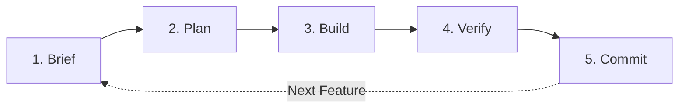

# 📋 Dokumentasi MVP Version 1 — CompareBuy
**Mata Kuliah:** Rekayasa Perangkat Lunak (Pertemuan 5)  
**Proyek:** CompareBuy (Smart Gadget Recommendation & Comparison Platform)  
**Tech Stack:** FastAPI (Python), Pydantic v2, Next.js (TypeScript), SQLite / In-Memory Seed Data  
**Repository:** [FirmanFelixNduru/RPLWeb](https://github.com/FirmanFelixNduru/RPLWeb.git)  

---

## 1. Ringkasan MVP Version 1

MVP (*Minimum Viable Product*) Version 1 CompareBuy berfokus pada penguatan dan pemastian keandalan **dua fitur inti backend** yang menjadi nilai jual utama platform:

```
+-----------------------------------------------------------------------------------+
|                              COMPAREBUY - MVP VERSION 1                           |
+-----------------------------------------------------------------------------------+
|  [Fitur 1] Weighted Dynamic Scoring Engine (SPK/MCDA)                             |
|  - Perhitungan rekomendasi berbasis 8 dimensi terbobot dinamis                    |
|  - Normalisasi vektor bobot (sum = 1.0) dengan scenario boost & custom priority   |
|  - Budget modifier (+5, +2, -5, -15) & generasi narasi "Why This Product"         |
|  - Validasi ketat Pydantic v2 (skala 1-5, budget_max >= budget_min)               |
+-----------------------------------------------------------------------------------+
|  [Fitur 2] Side-by-Side Comparison Matrix & Auto-Highlighting Engine              |
|  - Komparasi 2 hingga 4 produk lintas spesifikasi teknis                          |
|  - Ekstraksi numerik otomatis dari string spesifikasi (mAh, MP, Hz, g, Rp)        |
|  - Auto-Highlighting spesifikasi terbaik (Higher-is-Better vs Lower-is-Better)    |
|  - Penentuan pemenang harga termurah & validasi ID unik produk                    |
+-----------------------------------------------------------------------------------+
```

### Fitur 1: Weighted Dynamic Scoring Engine (SPK/MCDA)
* **Lokasi Kode:** [`backend/app/scoring.py`](file:///c:/KULIAH/Semester%203/Rekayasa%20Perangkat%20Lunak/backend/app/scoring.py) & [`backend/app/models.py`](file:///c:/KULIAH/Semester%203/Rekayasa%20Perangkat%20Lunak/backend/app/models.py)
* **Deskripsi:** Sistem Pendukung Keputusan (*Multi-Criteria Decision Analysis*) yang mengevaluasi produk berdasarkan preferensi pengguna. Mengkalkulasi skor tertimbang dari 8 dimensi (*performance, camera, battery, display, build quality, value, audio, software*), menerapkan *scenario boost* (misal: gaming, fotografi, pelajar), serta memberikan bonus/penalti anggaran (*budget modifier*) dan menghasilkan narasi rekomendasi transparan (*why this product*).

### Fitur 2: Side-by-Side Comparison Matrix & Auto-Highlighting Engine
* **Lokasi Kode:** [`backend/app/routers/compare.py`](file:///c:/KULIAH/Semester%203/Rekayasa%20Perangkat%20Lunak/backend/app/routers/compare.py)
* **Deskripsi:** Engine perbandingan spesifikasi 2 hingga 4 produk secara berdampingan. Menggunakan algoritma *regex extraction* untuk membedah data spesifikasi tekstual ke representasi numerik dan menentukan spesifikasi terbaik (*auto-highlighting*) dengan aturan *Higher-is-Better* (RAM, baterai, refresh rate) dan *Lower-is-Better* (bobot perangkat dan harga produk).

---

## 2. Alur Kerja Iteratif (Brief → Plan → Build → Verify → Commit)

Pengembangan MVP v1 dijalankan dengan metodologi rekayasa perangkat lunak iteratif yang terstruktur:



### A. Fitur 1: Weighted Dynamic Scoring Engine

| Tahap | Aktivitas & Rincian Teknis |
|---|---|
| **1. Brief** | Menganalisis kebutuhan engine scoring rekomendasi gadget. Memastikan perhitungan matematis tidak bias, vektor bobot selalu valid 1.0, dan penanganan input boundary pada anggaran belanja. |
| **2. Plan** | Merancang 6 kategori pengujian unit test (44 test cases): normalisasi vektor bobot, skenario boost, kalkulasi modifier budget, perhitungan skor & ranking terurut, generasi teks narasi, serta validasi skema Pydantic. Diajukan dan disetujui mahasiswa. |
| **3. Build** | - Mengimplementasikan `@model_validator(mode="after")` di `WizardInput` ([`models.py`](file:///c:/KULIAH/Semester%203/Rekayasa%20Perangkat%20Lunak/backend/app/models.py)) untuk mencegah `budget_max < budget_min` dan membatasi prioritas 1–5.<br>- Membuat test suite komprehensif di [`backend/tests/test_scoring.py`](file:///c:/KULIAH/Semester%203/Rekayasa%20Perangkat%20Lunak/backend/tests/test_scoring.py). |
| **4. Verify** | Menjalankan pengujian terminal: `.venv\Scripts\python.exe -m unittest tests.test_scoring -v`. Seluruh 44 test cases dinyatakan **PASSED** dalam waktu 0.125 detik tanpa error. |
| **5. Commit** | **Hash:** `8e25f8e`<br>**Pesan Commit:** `feat(scoring): add unit tests for Weighted Dynamic Scoring Engine (MVP v1 Feature 1)` |

---

### B. Fitur 2: Side-by-Side Comparison Matrix & Auto-Highlighting Engine

| Tahap | Aktivitas & Rincian Teknis |
|---|---|
| **1. Brief** | Menganalisis kebutuhan matriks komparasi produk di endpoint `POST /api/compare`. Fitur harus mengekstrak angka dari berbagai satuan (mAh, MP, Hz, gram, Rupiah) dan menandai produk unggulan pada setiap baris spesifikasi. |
| **2. Plan** | Merancang skenario test matrix (49 test cases) di [`backend/tests/test_compare.py`](file:///c:/KULIAH/Semester%203/Rekayasa%20Perangkat%20Lunak/backend/tests/test_compare.py) meliputi ekstraksi regex, pemetaan *higher/lower-is-better*, determinasi pemenang, integrasi endpoint HTTP, dan struktur respons *highlight*. |
| **3. Build** | - **Review Mahasiswa:** Mahasiswa menginstruksikan bahwa field `price` harus diperlakukan sebagai *lower-is-better* (harga lebih murah = lebih baik).<br>- **Refactor:** Memperbarui `_higher_is_better()` di [`compare.py`](file:///c:/KULIAH/Semester%203/Rekayasa%20Perangkat%20Lunak/backend/app/routers/compare.py) untuk menyertakan `"price"`.<br>- **Refactor:** Menghapus duplikasi validasi ID duplikat di handler `compare.py` karena telah ditangani di layer request parsing oleh `@field_validator` Pydantic.<br>- **Build Tests:** Menulis 49 test cases di `backend/tests/test_compare.py`. |
| **4. Verify** | Menjalankan pengujian: `.venv\Scripts\python.exe -m unittest tests.test_compare -v`. Mengatasi penyesuaian ekspektasi status code (422 Pydantic vs 400 handler). Verifikasi ulang: 49/49 PASSED. Full regression check (Fitur 1 + 2): **93/93 PASSED** dalam 0.353 detik. |
| **5. Commit** | **Hash:** `2af3ced`<br>**Pesan Commit:** `feat(compare): add unit tests & refactor auto-highlighting engine (MVP v1 Feature 2)` |

---

## 3. Bukti Testing & Verifikasi

### Perintah Terminal Eksekusi Test
Pengujian dieksekusi dari direktori `backend` menggunakan virtual environment Python:

```powershell
# Jalankan seluruh test suite (Fitur 1 + Fitur 2)
.venv\Scripts\python.exe -m unittest discover -s tests -p "test_*.py" -v

# Jalankan pengujian Fitur 1 saja
.venv\Scripts\python.exe -m unittest tests.test_scoring -v

# Jalankan pengujian Fitur 2 saja
.venv\Scripts\python.exe -m unittest tests.test_compare -v
```

### Ringkasan Statistik Test Suite

| Test Suite | File Pengujian | Kategori Pengujian | Jumlah Test | Status | Durasi |
|---|---|---|:---:|:---:|:---:|
| **Fitur 1 (Scoring)** | `tests/test_scoring.py` | Vektor Normalisasi (8)<br>Scenario Boosts (5)<br>Budget Modifier (10)<br>Calculate Scores (9)<br>Narrative Generation (4)<br>Pydantic Validation (8) | 44 | **PASSED** | 0.125s |
| **Fitur 2 (Compare)** | `tests/test_compare.py` | Numeric Extraction (13)<br>Higher Is Better Logic (10)<br>Determine Best Logic (9)<br>Compare API Endpoint (10)<br>Highlight Structure (7) | 49 | **PASSED** | 0.228s |
| **TOTAL KESELURUHAN** | **2 Test Files** | **11 Test Fixtures** | **93** | **PASSED (100%)** | **0.359s** |

### Bukti Cuplikan Output Terminal Riil

```text
test_all_dimensions_covered (test_scoring.TestWeightVectorNormalization.test_all_dimensions_covered) ... ok
test_custom_priorities_sum_to_one (test_scoring.TestWeightVectorNormalization.test_custom_priorities_sum_to_one) ... ok
test_default_priorities_sum_to_one (test_scoring.TestWeightVectorNormalization.test_default_priorities_sum_to_one) ... ok
test_gaming_boosts_performance (test_scoring.TestScenarioBoosts.test_gaming_boosts_performance) ... ok
test_budget_max_less_than_min_is_rejected (test_scoring.TestWizardInputValidation.test_budget_max_less_than_min_is_rejected) ... ok
test_extract_numeric_with_units (test_compare.TestExtractNumeric.test_extract_numeric_with_units) ... ok
test_price_is_lower_is_better (test_compare.TestHigherIsBetter.test_price_is_lower_is_better) ... ok
test_determine_best_price_picks_cheapest (test_compare.TestDetermineBest.test_determine_best_price_picks_cheapest) ... ok
test_compare_duplicate_ids_returns_422 (test_compare.TestCompareEndpoint.test_compare_duplicate_ids_returns_422) ... ok
test_compare_two_valid_products_returns_200 (test_compare.TestCompareEndpoint.test_compare_two_valid_products_returns_200) ... ok
...
----------------------------------------------------------------------
Ran 93 tests in 0.359s

OK
```

---

## 4. Draf Jawaban untuk Dosen (Poin Presentasi)

Bagian ini dirancang khusus sebagai panduan argumentasi dan tanya-jawab saat presentasi atau evaluasi di hadapan Dosen Pengampu:

### 1. Apa yang Dikerjakan oleh AI Agent?
* **Scaffolding Test Suite yang Rinci:** AI Agent merancang struktur pengujian unit test terisolasi (`backend/tests/test_scoring.py` dan `backend/tests/test_compare.py`) dengan mencakup seluruh kemungkinan *corner cases* (kasus batas numerik, string kosong, format satuan, dan handling nilai `None`).
* **Penyusunan Mocking & Fixtures:** Mengonfigurasi `TestClient` FastAPI, request payload sintetis, dan kalkulasi matematis komparatif tanpa ketergantungan database eksternal.
* **Deteksi Inkonsistensi Error Handling:** AI Agent membantu mengidentifikasi bahwa endpoint `/api/compare` memiliki dua lapis validasi ID duplikat (HTTP 400 di handler vs HTTP 422 di Pydantic) dan menyarankan unifikasi ke standar Pydantic.

### 2. Apa yang Direview dan Diubah oleh Mahasiswa?
* **Injeksi Validasi Domain Logika pada Pydantic:**
  Mahasiswa menambahkan `@model_validator(mode="after")` pada `WizardInput` di [`models.py`](file:///c:/KULIAH/Semester%203/Rekayasa%20Perangkat%20Lunak/backend/app/models.py) untuk memastikan:
  1. `budget_max >= budget_min`. Jika `budget_max < budget_min`, sistem melempar `ValueError` deskriptif.
  2. Nilai prioritas dibatasi secara ketat hanya pada rentang integer 1 sampai 5 (`1 <= priority <= 5`).
  3. Dimensi prioritas divalidasi terhadap *whitelist* 8 dimensi yang sah (`performance`, `camera`, `battery`, `display`, `build_quality`, `value`, `audio`, `software`).
* **Koreksi Logika Bisnis Komparasi Harga (*Critical Bug Catch*):**
  Pada saat meninjau implementasi Fitur 2, mahasiswa menemukan bahwa fungsi `_higher_is_better` di [`compare.py`](file:///c:/KULIAH/Semester%203/Rekayasa%20Perangkat%20Lunak/backend/app/routers/compare.py) hanya mengecualikan `"weight"`. Akibatnya, produk dengan harga **paling mahal** akan ditandai sebagai pemenang perbandingan harga. Mahasiswa menginstruksikan penambahan `"price"` ke dalam tuple *lower-is-better*, sehingga produk **termurah** yang berhak memenangkan penyorotan (*highlight*).
* **Penetapan Toleransi Floating-Point:**
  Mahasiswa menetapkan batas toleransi matematis `delta=1e-6` dalam pengujian normalisasi bobot `sum(weights) == 1.0` untuk mencegah *floating-point arithmetic precision issues* pada Python.

### 3. Bagaimana Fitur Diverifikasi?
* **Unit Testing Terisolasi:** Menguji fungsi-fungsi murni (*pure functions*) seperti `_build_weight_vector()`, `_calculate_budget_modifier()`, `_extract_numeric()`, dan `_determine_best()` secara langsung tanpa memanggil HTTP server.
* **API Integration Testing via FastAPI `TestClient`:** Mengirim payload HTTP `POST` ke `/api/wizard/recommend` dan `/api/compare` untuk memvalidasi *request validation*, HTTP response status (200 OK, 404 Not Found, 422 Unprocessable Entity), serta integritas struktur JSON response.
* **Full Regression Suite:** Menjalankan total 93 test sekaligus untuk memastikan penambahan Fitur 2 tidak merusak (*break*) logika Fitur 1.

### 4. Mengapa Perubahan Tersebut Diperlukan?
* **Mencegah Error Logika dan Crash di Runtime:** Parameter input seperti `budget_min: 10.000.000` dan `budget_max: 5.000.000` adalah anomali input pengguna yang dapat merusak perhitungan penalti anggaran atau mengembalikan daftar kosong tanpa penjelasan.
* **Menjamin Validitas Rekomendasi SPK (MCDA):** Rekomendasi multi-kriteria hanya valid jika jumlah total bobot kriteria tepat bernilai 1.0 (100%). Tanpa normalisasi dan skala prioritas yang terkontrol (1-5), produk dengan spesifikasi minor dapat mendominasi skor secara tidak adil.
* **Integritas UX dan Kepercayaan Pengguna:** Menandai ponsel Rp 25.000.000 sebagai "lebih unggul" daripada ponsel Rp 8.000.000 dalam kategori perbandingan *Price* adalah kekeliruan fatal UX pada aplikasi perbandingan belanja.

---

## 5. Naskah Singkat Demo (30–60 Detik)

Gunakan panduan waktu dan aksi berikut saat mempraktikkan demo kepada Dosen:

```
+-----------------------------------------------------------------------------------------+
|                              NASKAH DEMO DOSEN (30-60 DETIK)                            |
+---------+-------------------------------------------------------------------------------+
| Durasi  | Aksi Praktis di Layar & Narasi                                                |
+---------+-------------------------------------------------------------------------------+
| 00-10s  | [Buka Terminal Backend di VS Code / IDE]                                      |
|         | Perintah: .venv\Scripts\python.exe -m unittest discover -s tests -v           |
|         | Narasi: "Selamat pagi/siang Bapak/Ibu. Untuk MVP Version 1, kami menerapkan   |
|         | prinsip Test-Driven Engineering secara iteratif. Di layar terlihat seluruh   |
|         | 93 unit test untuk Fitur 1 dan Fitur 2 berjalan 100% PASSED dalam 0.3 detik." |
+---------+-------------------------------------------------------------------------------+
| 10-25s  | [Buka file backend/app/models.py baris 139-154 & backend/app/scoring.py]     |
|         | Narasi: "Pada Fitur 1 (Dynamic Scoring Engine), kami memastikan bobot         |
|         | matematis 8 dimensi selalu ternormalisasi tepat 1.0. Sebagai mahasiswa,      |
|         | saya mereview dan menambahkan @model_validator Pydantic agar budget_max      |
|         | tidak boleh lebih kecil dari budget_min dan skala prioritas terkunci 1-5."    |
+---------+-------------------------------------------------------------------------------+
| 25-45s  | [Buka file backend/app/routers/compare.py baris 38-43]                        |
|         | Narasi: "Pada Fitur 2 (Comparison Matrix), AI Agent awalnya membuat fungsi    |
|         | _higher_is_better hanya untuk bobot. Melalui review code, saya mengoreksi    |
|         | agar 'price' juga diperlakukan sebagai lower-is-better, sehingga produk      |
|         | termurah yang benar-benar memenangkan highlight komparasi harga."             |
+---------+-------------------------------------------------------------------------------+
| 45-60s  | [Tampilkan git log -n 2 --oneline di Terminal]                                |
|         | Narasi: "Setiap tahap kami jalankan berurutan: Brief, Plan, Build, Verify,   |
|         | hingga Commit dengan commit history yang rapi di Git. Seluruh kode siap     |
|         | diintegrasikan ke frontend Next.js pada iterasi berikutnya. Terima kasih."    |
+---------+-------------------------------------------------------------------------------+
```

---

## 6. Riwayat Commit Git (Traceability)

Bukti rekam jejak version control pada repositori Git lokal dan remote:

```text
2af3ced feat(compare): add unit tests & refactor auto-highlighting engine (MVP v1 Feature 2)
8e25f8e feat(scoring): add unit tests for Weighted Dynamic Scoring Engine (MVP v1 Feature 1)
```

Dokumentasi ini membuktikan pemenuhan seluruh capaian pembelajaran mata kuliah Rekayasa Perangkat Lunak untuk Pertemuan 5 (Pembangunan MVP secara Iteratif & Kolaborasi Human-AI yang Terverifikasi).
